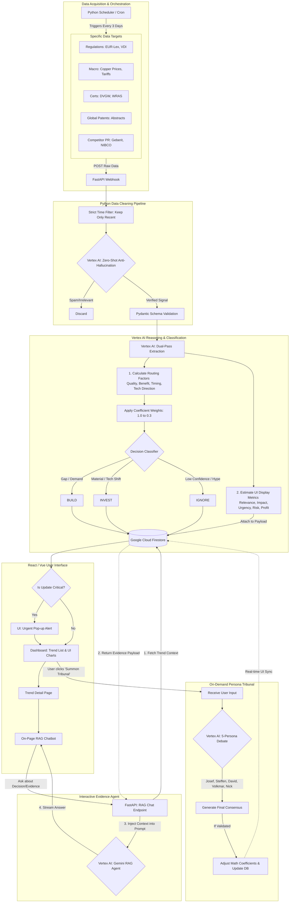

```mermaid
graph TD
    subgraph Data Acquisition [Data Acquisition & Orchestration]
        Cron[Python Scheduler / Cron] -->|Triggers Every 3 Days| Sources
        
        subgraph Sources [Specific Data Targets]
            S1[Regulations: EUR-Lex, VDI]
            S2[Macro: Copper Prices, Tariffs]
            S3[Certs: DVGW, WRAS]
            S4[Global Patents: Abstracts]
            S5[Competitor PR: Geberit, NIBCO]
        end
        
        Sources -->|POST Raw Data| Webhook[FastAPI Webhook]
    end

    subgraph Backend Pipeline [Python Data Cleaning Pipeline]
        Webhook --> TimeFilter[Strict Time Filter: Keep Only Recent]
        TimeFilter --> ZeroShot{Vertex AI: Zero-Shot Anti-Hallucination}
        ZeroShot -->|Spam/Irrelevant| Discard[Discard]
        ZeroShot -->|Verified Signal| Pydantic[Pydantic Schema Validation]
    end

    subgraph Intelligence Engine [Vertex AI Reasoning & Classification]
        Pydantic --> DualEval[Vertex AI: Dual-Pass Extraction]
        
        DualEval --> Factors[1. Calculate Routing Factors <br/> Quality, Benefit, Timing, Tech Direction]
        DualEval --> UIMetrics[2. Estimate UI Display Metrics <br/> Relevance, Impact, Urgency, Risk, Profit]
        
        Factors --> Math[Apply Coefficient Weights: 1.0 to 0.3]
        Math --> Classifier{Decision Classifier}
        
        Classifier -->|Gap / Demand| D1[BUILD]
        Classifier -->|Material / Tech Shift| D2[INVEST]
        Classifier -->|Low Confidence / Hype| D4[IGNORE]
        
        %% Both final decisions and UI metrics go to DB
        D1 & D2 & D4 --> DB[(Google Cloud Firestore)]
        UIMetrics -->|Attach to Payload| DB
    end

    subgraph Frontend [React / Vue User Interface]
        DB --> CriticalCheck{Is Update Critical?}
        CriticalCheck -->|Yes| Alert[UI: Urgent Pop-up Alert]
        CriticalCheck -->|No| Dashboard[Dashboard: Trend List & UI Charts]
        Alert --> Dashboard
        
        Dashboard --> TrendPage[Trend Detail Page]
        TrendPage --> ChatUI[On-Page RAG Chatbot]
    end
    
    subgraph RAG System [Interactive Evidence Agent]
        ChatUI -->|Ask about Decision/Evidence| RAG_API[FastAPI: RAG Chat Endpoint]
        RAG_API -->|1. Fetch Trend Context| DB
        DB -.->|2. Return Evidence Payload| RAG_API
        RAG_API -->|3. Inject Context into Prompt| RAG_LLM{Vertex AI: Gemini RAG Agent}
        RAG_LLM -->|4. Stream Answer| ChatUI
    end

    subgraph Human in the Loop [On-Demand Persona Tribunal]
        Dashboard -->|User clicks 'Summon Tribunal'| FeedbackIn[Receive User Input]
        FeedbackIn --> Debate{Vertex AI: 5-Persona Debate}
        Debate -->|Josef, Steffen, David, Volkmar, Nick| Consensus[Generate Final Consensus]
        Consensus -->|If Validated| UpdateWeights[Adjust Math Coefficients & Update DB]
        UpdateWeights -.->|Real-time UI Sync| DB
    end
```
