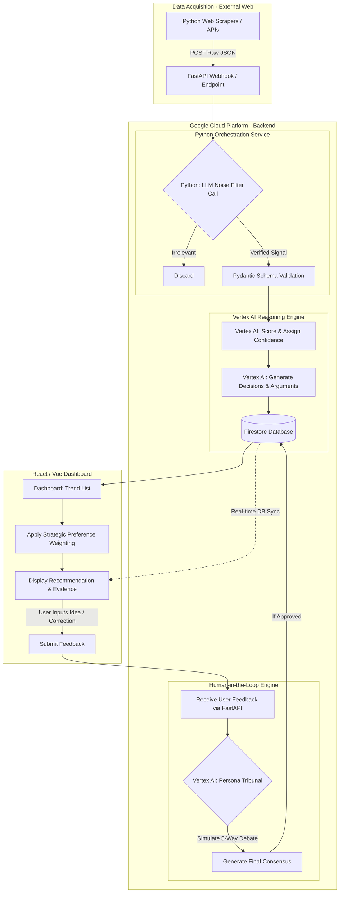

```mermaid
graph TD
    subgraph Acquisition [Data Acquisition - External Web]
        A[Python Web Scrapers / APIs] -->|POST Raw JSON| B[FastAPI Webhook / Endpoint]
    end

    subgraph GCP [Google Cloud Platform - Backend]
        subgraph Integration [Python Orchestration Service]
            B --> C{Python: LLM Noise Filter Call}
            C -->|Irrelevant| D[Discard]
            C -->|Verified Signal| E[Pydantic Schema Validation]
        end

        subgraph Reasoning [Vertex AI Reasoning Engine]
            E --> F[Vertex AI: Score & Assign Confidence]
            F --> G[Vertex AI: Generate Decisions & Arguments]
            G --> H[(Firestore Database)]
        end
        
        subgraph HITL [Human-in-the-Loop Engine]
            N[Receive User Feedback via FastAPI] --> O{Vertex AI: Persona Tribunal}
            O -->|Simulate 5-Way Debate| P[Generate Final Consensus]
            P -->|If Approved| H
        end
    end

    subgraph Frontend [React / Vue Dashboard]
        H --> I[Dashboard: Trend List]
        I --> J[Apply Strategic Preference Weighting]
        J --> K[Display Recommendation & Evidence]
        
        K -->|User Inputs Idea / Correction| L[Submit Feedback]
        L --> N
        
        H -.->|Real-time DB Sync| K
    end
```
