# Futury x Viega Challenge 2026: The Intelligent Compass

## 1. The Core Problem
**"Thirsty for insight, drowning in data"**
Companies struggle to systematically monitor competitors, market movements, and emerging technologies (like patents). Relevant signals are scattered across multiple sources, making it difficult to distinguish noise from meaningful insights. As a result, product decisions are often reactive, biased, or too late. This primarily affects strategic roles like Product Management and Pre-Development.

## 2. The Mission
**Build a solution that automatically analyzes market and competitor data (including patents) and translates signals into clear, actionable product decisions.**
Develop a prototype for an intelligent assistant that empowers Product Managers by transforming scattered market data into clear, actionable product decisions.

## System Architecture & Workflow :
**Here is a high-level overview of how the Intelligent Compass translates raw data into strategic insights**

```mermaid
flowchart TD
    subgraph Data_Acquisition [Data Acquisition & Orchestration]
        Cron[Python Scheduler / Cron] -->|Triggers Every 3 Days| Sources
        
        subgraph Sources [Specific Data Targets]
            direction LR
            S1[Regulations: EUR-Lex, VDI]
            S2[Macro: Copper Prices, Tariffs]
            S3[Certs: DVGW, WRAS]
            S4[Global Patents: Abstracts]
            S5[Competitor PR: Geberit, NIBCO]
        end
        
        Sources -->|POST Raw Data| Webhook[FastAPI Webhook]
    end

    subgraph Backend_Pipeline [Python Data Cleaning Pipeline]
        Webhook --> TimeFilter[Strict Time Filter: Keep Only Recent]
        TimeFilter --> ZeroShot{Vertex AI: Zero-Shot Anti-Hallucination}
        ZeroShot -->|Spam/Irrelevant| Discard[Discard]
        ZeroShot -->|Verified Signal| Pydantic[Pydantic Schema Validation]
    end

    subgraph Intelligence_Engine [Vertex AI Reasoning & Classification]
        Pydantic --> DualEval[Vertex AI: Dual-Pass Extraction]
        
        DualEval --> Factors["1. Calculate Routing Factors <br/> Quality, Benefit, Timing, Tech Direction"]
        DualEval --> UIMetrics["2. Estimate UI Display Metrics <br/> Relevance, Impact, Urgency, Risk, Profit"]
        
        Factors --> Math[Apply Coefficient Weights: 1.0 to 0.3]
        Math --> Classifier{Decision Classifier}
        
        subgraph Decisions [Decision Outputs]
            direction LR
            D1[BUILD]
            D2[INVEST]
            D4[IGNORE]
        end

        Classifier -->|Gap / Demand| D1
        Classifier -->|Material / Tech Shift| D2
        Classifier -->|Low Confidence / Hype| D4
        
        %% Both final decisions and UI metrics go to DB
        D1 & D2 & D4 --> DB[(Google Cloud Firestore)]
        UIMetrics -->|Attach to Payload| DB
    end

    subgraph Frontend [React / Vue User Interface]
        DB --> CriticalCheck{Is Update Critical?}
        CriticalCheck -->|Yes| Alert[UI: Urgent Pop-up Alert]
        CriticalCheck -->|No| Dashboard[Dashboard: Trend List & UI Charts]
        Alert --> Dashboard
        
        Dashboard --> TrendPage[Trend Detail Page]
        TrendPage --> ChatUI[On-Page RAG Chatbot]
    end
    
    subgraph RAG_System [Interactive Evidence Agent]
        ChatUI -->|Ask about Decision/Evidence| RAG_API[FastAPI: RAG Chat Endpoint]
        RAG_API -->|1. Fetch Trend Context| DB
        DB -.->|2. Return Evidence Payload| RAG_API
        RAG_API -->|3. Inject Context into Prompt| RAG_LLM{Vertex AI: Gemini RAG Agent}
        RAG_LLM -->|4. Stream Answer| ChatUI
    end

    subgraph Human_in_the_Loop [On-Demand Persona Tribunal]
        Dashboard -->|User clicks 'Summon Tribunal'| FeedbackIn[Receive User Input]
        FeedbackIn --> Debate{Vertex AI: 5-Persona Debate}
        Debate -->|Josef, Steffen, David, Volkmar, Nick| Consensus[Generate Final Consensus]
        Consensus -->|If Validated| UpdateWeights[Adjust Math Coefficients & Update DB]
        UpdateWeights -.->|Real-time UI Sync| DB
    end

    %% --- STYLING ---
    style ZeroShot fill:#ff6b6b,color:white
    style DualEval fill:#ff6b6b,color:white
    style RAG_LLM fill:#ff6b6b,color:white
    style Debate fill:#ff6b6b,color:white
    
    style DB fill:#9c27b0,color:white
    
    style Dashboard fill:#2196f3,color:white
    style ChatUI fill:#2196f3,color:white
    style TrendPage fill:#2196f3,color:white
    
    style Classifier fill:#ff9800,color:white
    style Math fill:#ff9800,color:white
    
    style Pydantic fill:#4caf50,color:white
    style Consensus fill:#4caf50,color:white
    style UpdateWeights fill:#4caf50,color:white
    
    style FeedbackIn fill:#f1c40f,color:blackflowchart TD
    subgraph Data_Acquisition [Data Acquisition & Orchestration]
        Cron[Python Scheduler / Cron] -->|Triggers Every 3 Days| Sources
        
        subgraph Sources [Specific Data Targets]
            direction LR
            S1[Regulations: EUR-Lex, VDI]
            S2[Macro: Copper Prices, Tariffs]
            S3[Certs: DVGW, WRAS]
            S4[Global Patents: Abstracts]
            S5[Competitor PR: Geberit, NIBCO]
        end
        
        Sources -->|POST Raw Data| Webhook[FastAPI Webhook]
    end

    subgraph Backend_Pipeline [Python Data Cleaning Pipeline]
        Webhook --> TimeFilter[Strict Time Filter: Keep Only Recent]
        TimeFilter --> ZeroShot{Vertex AI: Zero-Shot Anti-Hallucination}
        ZeroShot -->|Spam/Irrelevant| Discard[Discard]
        ZeroShot -->|Verified Signal| Pydantic[Pydantic Schema Validation]
    end

    subgraph Intelligence_Engine [Vertex AI Reasoning & Classification]
        Pydantic --> DualEval[Vertex AI: Dual-Pass Extraction]
        
        DualEval --> Factors["1. Calculate Routing Factors <br/> Quality, Benefit, Timing, Tech Direction"]
        DualEval --> UIMetrics["2. Estimate UI Display Metrics <br/> Relevance, Impact, Urgency, Risk, Profit"]
        
        Factors --> Math[Apply Coefficient Weights: 1.0 to 0.3]
        Math --> Classifier{Decision Classifier}
        
        subgraph Decisions [Decision Outputs]
            direction LR
            D1[BUILD]
            D2[INVEST]
            D4[IGNORE]
        end

        Classifier -->|Gap / Demand| D1
        Classifier -->|Material / Tech Shift| D2
        Classifier -->|Low Confidence / Hype| D4
        
        %% Both final decisions and UI metrics go to DB
        D1 & D2 & D4 --> DB[(Google Cloud Firestore)]
        UIMetrics -->|Attach to Payload| DB
    end

    subgraph Frontend [React / Vue User Interface]
        DB --> CriticalCheck{Is Update Critical?}
        CriticalCheck -->|Yes| Alert[UI: Urgent Pop-up Alert]
        CriticalCheck -->|No| Dashboard[Dashboard: Trend List & UI Charts]
        Alert --> Dashboard
        
        Dashboard --> TrendPage[Trend Detail Page]
        TrendPage --> ChatUI[On-Page RAG Chatbot]
    end
    
    subgraph RAG_System [Interactive Evidence Agent]
        ChatUI -->|Ask about Decision/Evidence| RAG_API[FastAPI: RAG Chat Endpoint]
        RAG_API -->|1. Fetch Trend Context| DB
        DB -.->|2. Return Evidence Payload| RAG_API
        RAG_API -->|3. Inject Context into Prompt| RAG_LLM{Vertex AI: Gemini RAG Agent}
        RAG_LLM -->|4. Stream Answer| ChatUI
    end

    subgraph Human_in_the_Loop [On-Demand Persona Tribunal]
        Dashboard -->|User clicks 'Summon Tribunal'| FeedbackIn[Receive User Input]
        FeedbackIn --> Debate{Vertex AI: 5-Persona Debate}
        Debate -->|Josef, Steffen, David, Volkmar, Nick| Consensus[Generate Final Consensus]
        Consensus -->|If Validated| UpdateWeights[Adjust Math Coefficients & Update DB]
        UpdateWeights -.->|Real-time UI Sync| DB
    end

    %% --- STYLING ---
    style ZeroShot fill:#ff6b6b,color:white
    style DualEval fill:#ff6b6b,color:white
    style RAG_LLM fill:#ff6b6b,color:white
    style Debate fill:#ff6b6b,color:white
    
    style DB fill:#9c27b0,color:white
    
    style Dashboard fill:#2196f3,color:white
    style ChatUI fill:#2196f3,color:white
    style TrendPage fill:#2196f3,color:white
    
    style Classifier fill:#ff9800,color:white
    style Math fill:#ff9800,color:white
    
    style Pydantic fill:#4caf50,color:white
    style Consensus fill:#4caf50,color:white
    style UpdateWeights fill:#4caf50,color:white
    
    style FeedbackIn fill:#f1c40f,color:black
```




## 3. Challenge Details & Objectives
**Deliverables:**
* Deliver a working prototype or clickable demo.
* Provide a clear decision output: **"Build / Invest / Ignore"**.
* Suggest a feature or product direction.
* Provide prioritization or impact estimation of recommendations.

**Core Objectives:**
1.  **Automated Signal Detection:** Automatically aggregate data from public sources and identify relevant signals (feature launches, tech trends, patents, forums).
2.  **Actionable Dashboard:** Deliver a clickable demo presenting insights, summaries, and trends in an understandable format with clear recommendations.
3.  **User-Centric Design:** Design from the perspective of a Product Manager, using 5 distinct personas:
    * Josef, the Loyal Traditionalist
    * Steffen, the Demanding Doer
    * David, the Digital Innovator
    * Volkmar, the Cautious Follower
    * Nick, the Sustainable Companion

**The "Boss Level" (Optional Goals):**
* **AI Persona Debate:** Create AI personas (e.g., David vs. Josef) that autonomously debate strategic choices and output a summarized proposal.
* **Human-in-the-Loop:** Implement real user feedback (rating slider) to train the model (Target users: Engineers, Craftsmen, Wholesalers, Contractors).
* **Focus Area / Deep Dive:** Apply the solution to "Serial Construction" or "Drinking Water Management".
* **Downstream Process Integration:** Connect insights to Text-to-CAD processes or business case outlines.

## 4. Data & Constraints
* **Data Sources:** Must use publicly available data. Patent databases can be simulated. Self-generated or simulated data is permitted.
* **Confidentiality:** NO use of internal Viega systems, confidential data, or sensitive information.
* **Technical Stack:** Must be built on a database for machine-readable storage (no local files). **The use of n8n is strongly encouraged** as an integration layer.
* **Scope:** European Union focus.
* **Output:** Working prototype or clickable demo (not production-ready).

## 5. Use Cases for Testing
* **Use Case 1: Reacting to a Competitor Move**
    * *Scenario:* Competitor "AquaSystems Inc." announces a "Smart-Press" fitting series reducing install time by 30%, with a related U.S. patent.
    * *Task:* Aggregate data, assess relevance/impact, recommend Action (Build/Invest/Ignore) with reasoning.
* **Use Case 2: Analyzing a Market Problem Signal**
    * *Scenario:* Forums/news discuss inefficiencies and high costs installing cooling systems in modular data centers.
    * *Task:* Validate/quantify trend, identify pain points, propose new product idea/solution direction.
* **Use Case 3: Scouting a New Technology**
    * *Scenario:* Dutch university publishes paper on lead-free soldering for copper pipes in drinking water.
    * *Task:* Evaluate potential, check if it's a macro trend ("green" building), identify competitor activity, recommend strategic action.

## 6. Market Context
**Main Competitors:**
* Geberit
* Conex Bänninger
* NIBCO
* TECE
* SCHELL
* Aliaxis
* Aalberts

**Customer Groups:**
* **Installers:** Focus on ease of installation, reliability, technical support.
* **Planners (Architects, Contractors):** Focus on innovative solutions, cost-effectiveness, specs, standards compliance.
* **Wholesalers:** Focus on efficient logistics, comprehensive product range.
* **End User:** Focus on comfort, design, energy efficiency, hygiene (influences product development).

## 7. About Viega
* **Status:** 125-year-old family business (5th generation). Global No. 1 in metallic press systems.
* **Scale:** >2.02 billion euros turnover (2024), >5,500 employees, 17,000 product articles.
* **Product Landscape:** Design, Heating & Cooling, Piping technology, Drainage technology, Pre-wall technology.
* **Application Areas:** Building technology, Industrial facilities, Shipbuilding, Supply technology (underground pipelines).

---

## 8. Setup & Running the Demo

### Prerequisites

Before starting, make sure you have the following installed and configured:

| Requirement | Version | Check |
| --- | --- | --- |
| Python | 3.10+ | `python --version` |
| pip | latest | `pip --version` |
| Google Cloud CLI | latest | `gcloud --version` |
| A GCP project | — | With **Firestore** (Native mode) and **Vertex AI API** enabled |

> **GCP APIs to enable** in your project console at `console.cloud.google.com`:
>
> * Cloud Firestore API
> * Vertex AI API
> * (Billing must be enabled — Vertex AI is not on the free tier)

---

### Step 1 — Clone and navigate

```bash
git clone https://github.com/Yacine-DH/Viega-x-FUTURY-Hackathon-Challenge.git
cd Viega-x-FUTURY-Hackathon-Challenge/viegtor/backend
```

---

### Step 2 — Create and activate the virtual environment

**Windows (PowerShell / CMD):**

```bash
python -m venv venv
venv\Scripts\activate
```

**macOS / Linux:**

```bash
python3 -m venv venv
source venv/bin/activate
```

You should see `(venv)` prepended to your terminal prompt.

---

### Step 3 — Install Python dependencies

```bash
pip install -r requirements.txt
```

---

### Step 4 — Install Playwright browser

The competitor IR scraper uses a headless Chromium browser with stealth mode.

```bash
playwright install chromium
```

---

### Step 5 — Authenticate with Google Cloud

The app uses **Application Default Credentials (ADC)** to access Firestore and Vertex AI.

```bash
gcloud auth application-default login
```

This opens a browser window. Sign in with the Google account that owns your GCP project.
Once done, credentials are saved locally and the app will pick them up automatically.

> **On a server / CI environment:** set the `GOOGLE_APPLICATION_CREDENTIALS` environment
> variable to the path of a service account JSON key file that has the following IAM roles:
>
> * `roles/datastore.user` (Firestore read/write)
> * `roles/aiplatform.user` (Vertex AI inference)

---

### Step 6 — Configure environment variables

Copy the example file and fill in your values:

```bash
cp .env.example .env
```

Open `.env` and set at minimum:

```dotenv
# Required
GCP_PROJECT_ID=your-gcp-project-id

# Optional — scrapers degrade gracefully if keys are missing
NEWS_API_KEY=your_newsapi_key          # https://newsapi.org/
TRADING_ECONOMICS_API_KEY=your_te_key  # https://tradingeconomics.com/api/
EPO_CLIENT_ID=your_epo_client_id       # https://developers.epo.org/
EPO_CLIENT_SECRET=your_epo_secret

# Scheduler webhook target (keep as-is for local dev)
WEBHOOK_BASE_URL=http://localhost:8000
```

> **Scrapers without API keys** fall back gracefully:
>
> * `scraper_commodities.py` → Playwright scrape on LME website
> * `scraper_news.py` → skipped with a warning log
> * `scraper_epo_patents.py` → skipped with a warning log

---

### Step 7 — Create the Firestore database

In the [GCP console](https://console.cloud.google.com/firestore), create a Firestore database in **Native mode** in the region closest to you (e.g., `europe-west3` for Frankfurt).

Keep the default database ID `(default)` unless you change `FIRESTORE_DATABASE` in `.env`.

> **Firestore composite index** — on the first `GET /signals` call, Firestore may prompt
> you in the logs to create a composite index on `strategic_signals` for
> `(created_at DESC)`. Follow the link in the log output to create it with one click.

---

### Step 8 — Run the server

```bash
python main.py
```

Or with hot-reload during development:

```bash
uvicorn main:app --reload --host 0.0.0.0 --port 8000
```

You should see output like:

```text
INFO  Vertex AI initialized (project=your-project, location=us-central1)
INFO  Scraper scheduler started — 6 jobs registered
INFO  Uvicorn running on http://0.0.0.0:8000
```

---

### Step 9 — Explore the API

Open your browser at **<http://localhost:8000/docs>** for the interactive Swagger UI.

All available endpoints:

| Method | Endpoint | Description |
| --- | --- | --- |
| `GET` | `/health` | Liveness check |
| `POST` | `/webhook/ingest` | Ingest a raw signal → full AI pipeline → Firestore |
| `GET` | `/signals` | List recent classified signals (optional `?decision=BUILD`) |
| `GET` | `/signals/stats` | Dashboard summary: counts per decision type |
| `GET` | `/signals/{signal_id}` | Fetch a single signal by ID |
| `POST` | `/chat/rag` | Stream a RAG answer about a signal (SSE) |
| `POST` | `/chat/rag/sync` | Same as above but returns full JSON (easier for testing) |
| `POST` | `/tribunal/summon` | Run the 5-persona debate on a signal |
| `GET` | `/tribunal/weights/current` | Inspect live source coefficient weights |
| `GET` | `/tribunal/{signal_id}` | Retrieve a saved tribunal session |

---

### Step 10 — Test the full pipeline end-to-end

**Option A — Inject a test signal manually via Swagger:**

`POST /webhook/ingest` with this body:

```json
{
  "source": "competitor_ir",
  "url": "https://www.geberit.com/investors/media-releases/test",
  "raw_text": "Geberit announces SmartPress Pro 2.0 — a new press-fitting series with integrated IoT leak detection, reducing installation time by 25%. Patent EP4123456 filed.",
  "timestamp": "2026-04-23T10:00:00Z",
  "source_weight": 1.0
}
```

The response will include the decision (`BUILD / INVEST / IGNORE`), the AI reasoning, and the weighted scores.


**Test the RAG chatbot** (once at least one signal is in Firestore):

`POST /chat/rag/sync`:

```json
{
  "signal_id": "<signal_id from step above>",
  "user_question": "Why was this classified as BUILD and not INVEST?"
}
```

**Test the Tribunal:**

`POST /tribunal/summon`:

```json
{
  "signal_id": "<signal_id>",
  "user_feedback": "I think this is more of a BUILD opportunity — our installers are asking for smarter fittings."
}
```

---

## 9. Project Structure

```text
Viega-x-FUTURY-Hackathon-Challenge/
├── CLAUDE.md                        ← Hackathon execution plan & coding directives
├── Architecture_Design.md           ← Full system architecture (Mermaid diagram)
├── UML.md                           ← Data model UML
├── scraping_resources.md            ← Data source specs & API coefficients
└── viegtor/
    └── backend/
        ├── main.py                  ← FastAPI app entry point (run this)
        ├── config.py                ← All env vars via pydantic-settings
        ├── scheduler.py             ← APScheduler cron — all scrapers every 3 days
        ├── .env.example             ← Copy to .env and fill in
        ├── requirements.txt
        ├── routers/
        │   ├── webhook.py           ← POST /webhook/ingest — full AI pipeline
        │   ├── signals.py           ← GET /signals, /signals/stats, /signals/{id}
        │   ├── chat.py              ← POST /chat/rag (SSE) + /chat/rag/sync (JSON)
        │   └── tribunal.py          ← POST /tribunal/summon + GET session/weights
        ├── schemas/
        │   ├── decisions.py         ← DecisionType, RoutingFactors, UIMetrics
        │   ├── signals.py           ← RawSignal, FilteredSignal, StrategicSignal, TribunalRequest/Response
        │   └── chat.py              ← ChatRequest, ChatResponse
        ├── engine/
        │   ├── vertex_client.py     ← Gemini Flash + Pro singletons, GenerationConfig helpers
        │   ├── prompts.py           ← All LLM prompt templates (zero-shot, dual-pass, RAG, tribunal)
        │   ├── zero_shot_filter.py  ← Gemini Flash relevance classification
        │   ├── dual_pass_extractor.py ← Gemini Pro Pass 1 (routing factors) + Pass 2 (UI metrics)
        │   ├── decision_classifier.py ← Pure-math weighted decision routing (BUILD/INVEST/IGNORE)
        │   ├── rag_agent.py         ← Streaming RAG agent (evidence-grounded Q&A)
        │   ├── tribunal_engine.py   ← 5-persona Gemini Pro debate engine
        │   └── coefficient_adjuster.py ← Validates + persists tribunal weight changes
        ├── scrapers/
        │   ├── base_scraper.py      ← Abstract base: freshness check, stealth page, webhook POST
        │   ├── scraper_epo_patents.py   ← EPO OPS REST API (competitor patents)
        │   ├── scraper_eurlex.py        ← EUR-Lex RSS (EU directives & regulations)
        │   ├── scraper_competitor_ir.py ← Playwright stealth (Geberit, Aalberts, Aliaxis) + NIBCO SEC EDGAR
        │   ├── scraper_ted_tenders.py   ← TED EU API (CPV 45330000 plumbing tenders)
        │   ├── scraper_commodities.py   ← Trading Economics API / LME copper fallback
        │   └── scraper_news.py          ← NewsAPI geopolitical & tariff alerts
        └── database/
            ├── firestore_client.py  ← AsyncClient singleton
            └── signal_repository.py ← All Firestore read/write operations
```

---

## 10. Architecture Overview

```text
Scrapers (cron every 3 days)
    └─► POST /webhook/ingest
            │
            ├─ Time filter (>72h old → discard)
            ├─ Gemini Flash zero-shot filter (irrelevant → discard)
            ├─ Gemini Pro Pass 1 → routing factors + title/summary/evidence
            ├─ Gemini Pro Pass 2 → UI display metrics
            ├─ Math classifier → BUILD / INVEST / IGNORE
            └─ Firestore (strategic_signals)
                    │
                    ├─► GET /signals           → Dashboard
                    ├─► POST /chat/rag         → RAG Evidence Chatbot (SSE stream)
                    └─► POST /tribunal/summon  → 5-Persona Debate
                                                    └─ Updates system_config coefficients
                                                    └─ Optionally overrides signal decision
```
