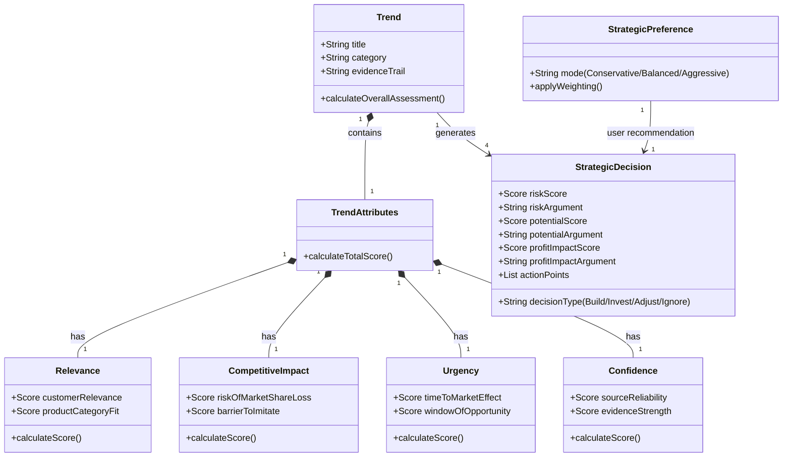

```mermaid
classDiagram
    class Trend {
        +String title
        +String category
        +String evidenceTrail
        +calculateOverallAssessment()
    }

    class TrendAttributes {
        +calculateTotalScore()
    }

    class Relevance {
        +Score customerRelevance
        +Score productCategoryFit
        +calculateScore()
    }

    class CompetitiveImpact {
        +Score riskOfMarketShareLoss
        +Score barrierToImitate
        +calculateScore()
    }

    class Urgency {
        +Score timeToMarketEffect
        +Score windowOfOpportunity
        +calculateScore()
    }

    class Confidence {
        +Score sourceReliability
        +Score evidenceStrength
        +calculateScore()
    }

    class StrategicDecision {
        +String decisionType (Build/Invest/Adjust/Ignore)
        +Score riskScore
        +String riskArgument
        +Score potentialScore
        +String potentialArgument
        +Score profitImpactScore
        +String profitImpactArgument
        +List actionPoints
    }

    class StrategicPreference {
        +String mode (Conservative/Balanced/Aggressive)
        +applyWeighting()
    }

    %% Relationships
    Trend "1" *-- "1" TrendAttributes : contains
    TrendAttributes "1" *-- "1" Relevance : has
    TrendAttributes "1" *-- "1" CompetitiveImpact : has
    TrendAttributes "1" *-- "1" Urgency : has
    TrendAttributes "1" *-- "1" Confidence : has
    
    Trend "1" --> "4" StrategicDecision : generates
    StrategicPreference "1" --> "1" StrategicDecision : user recommendation
```